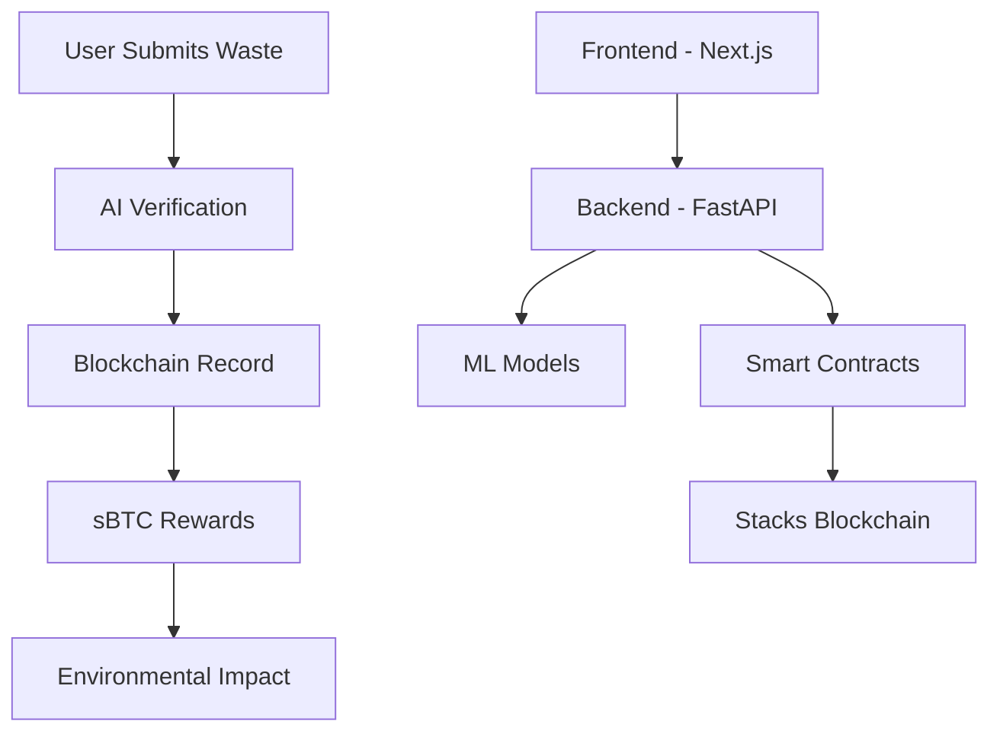

# 🌱 SatsVerdant

<div align="center">


**Turn Trash into Bitcoin - Earn sBTC for verified recycling**

[](https://satsverdant.netlify.app)
[](https://nextjs.org/)
[](https://fastapi.tiangolo.com/)
[](https://www.stacks.co/)

</div>

---

## � Vision

**SatsVerdant** is a revolutionary platform that proves Bitcoin can heal the planet, not hurt it. We create a circular economy where waste becomes valuable through blockchain verification and synthetic Bitcoin rewards.

### 💡 The Problem
- **Environmental Crisis**: 2.12 billion tons of waste generated annually
- **Low Recycling Rates**: Only 32% of waste gets recycled globally
- **Lack of Incentives**: No immediate reward for individual recycling efforts

### 🚀 Our Solution
- **Instant Rewards**: Earn sBTC for every verified recycling submission
- **Blockchain Verification**: Immutable proof of environmental impact
- **Zero Greenwashing**: Transparent, auditable waste tracking

---

## 🏗️ Architecture Overview



## 📁 Project Structure

```
mvp_folder/
├── 🎨 frontend/           # Next.js 16 + TypeScript + Tailwind CSS
│   ├── app/              # App Router pages
│   ├── components/       # Reusable UI components
│   ├── hooks/           # Custom React hooks
│   └── public/          # Static assets
├── ⚙️ backend/            # FastAPI + Python
│   ├── app/             # API endpoints
│   ├── models/          # Database models
│   ├── services/        # Business logic
│   └── tests/           # Test suite
├── 📜 contracts/         # Clarity Smart Contracts
│   ├── contracts/       # Smart contract code
│   ├── tests/          # Contract tests
│   └── settings/       # Deployment configs
├── 🤖 ml-training/        # Machine Learning Pipeline
│   ├── scripts/        # Training scripts
│   └── models/         # Trained models
└── 📚 docs/              # Documentation & PRDs
```

---

## �️ Technology Stack

### Frontend Technologies
| Technology | Version | Purpose |
|------------|---------|---------|
| **Next.js** | 16.0 | React framework with App Router |
| **TypeScript** | 5.9 | Type-safe development |
| **Tailwind CSS** | 4.1 | Utility-first styling |
| **shadcn/ui** | Latest | Component library |
| **React Hook Form** | 7.71 | Form management |
| **Zod** | 3.25 | Schema validation |

### Backend Technologies
| Technology | Version | Purpose |
|------------|---------|---------|
| **FastAPI** | Latest | High-performance API |
| **Python** | 3.12 | Backend language |
| **PostgreSQL** | Latest | Primary database |
| **Redis** | Latest | Caching layer |
| **Pydantic** | Latest | Data validation |

### Blockchain & ML
| Technology | Purpose |
|------------|---------|
| **Stacks** | Bitcoin L1 smart contracts |
| **Clarity** | Smart contract language |
| **TensorFlow** | ML model training |
| **PyTorch** | Alternative ML framework |

---

## � Quick Start

### Prerequisites
- Node.js 18+ and pnpm
- Python 3.12+ and pip
- Git

### 🎨 Frontend Setup
```bash
cd frontend
pnpm install
pnpm dev
```
🌐 Visit: `http://localhost:3000`

### ⚙️ Backend Setup
```bash
cd backend
pip install -r requirements.txt
uvicorn main:app --reload
```
🌐 Visit: `http://localhost:8000`

### 📜 Smart Contracts
```bash
cd contracts
npm install
npm run test
```

### 🤖 ML Training
```bash
cd ml-training
pip install -r requirements.txt
./run_pipeline.sh
```

---

## 🌟 Key Features

### 🏠 Landing Page
- **Hero Section**: Compelling value proposition
- **How It Works**: Step-by-step user journey
- **Social Proof**: Trust indicators and testimonials
- **Enterprise Solutions**: B2B offerings

### 📊 Dashboard Application
- **Overview**: Metrics and recent activity
- **Submit**: Waste submission with image upload
- **Validate**: Real-time submission tracking
- **Rewards**: sBTC earning and claiming
- **Impact**: Environmental impact visualization
- **Settings**: Profile and wallet management

### 🔗 Blockchain Integration
- **Smart Contracts**: Waste tokenization on Stacks
- **sBTC Rewards**: Synthetic Bitcoin incentives
- **Immutable Records**: Permanent environmental impact tracking
- **Transparent Auditing**: Public verification system

---

## 🌱 Environmental Impact

### 📈 Metrics Tracked
- **CO₂ Offset**: Carbon footprint reduction
- **Waste Diverted**: Total waste recycled
- **Recycling Rate**: Individual and community metrics
- **Reward Distribution**: sBTC earned and claimed

### 🎯 Sustainability Goals
- **Short Term**: 1,000 active users, 10 tons waste recycled
- **Medium Term**: 10,000 users, 100 tons waste recycled
- **Long Term**: 100,000 users, 1,000 tons waste recycled

---

## 🔧 Development Workflow

### 📋 Git Workflow
```bash
git clone https://github.com/austinLorenzMccoy/SatsVerdant.git
cd SatsVerdant
git checkout -b feature/your-feature
# Make changes
git commit -m "feat: add your feature"
git push origin feature/your-feature
# Create Pull Request
```

### 🧪 Testing
```bash
# Frontend tests
cd frontend && pnpm test

# Backend tests
cd backend && pytest

# Contract tests
cd contracts && npm test
```

### 🚀 Deployment
- **Frontend**: Netlify (automatic on main branch push)
- **Backend**: Render (manual deployment)
- **Contracts**: Stacks testnet/mainnet deployment

---

## 🤝 Contributing

We welcome contributions! Please see our [Contributing Guide](CONTRIBUTING.md) for details.

### 🎯 Areas for Contribution
- 🎨 **Frontend**: UI/UX improvements, new components
- ⚙️ **Backend**: API endpoints, database optimization
- 📜 **Smart Contracts**: New contract features, testing
- 🤖 **ML**: Model improvements, new algorithms
- 📚 **Documentation**: Guides, tutorials, API docs

---

## 📊 Project Status

### ✅ Completed Features
- [x] Landing page with hero and sections
- [x] Dashboard with all core pages
- [x] Smart contracts for waste tokenization
- [x] Backend API with FastAPI
- [x] ML pipeline for waste classification
- [x] Netlify deployment configuration

### 🚧 In Progress
- [ ] Backend deployment to Render
- [ ] Smart contract deployment to testnet
- [ ] Real wallet integration
- [ ] Image recognition for waste verification

### 🎯 Planned Features
- [ ] Mobile app (React Native)
- [ ] Advanced analytics dashboard
- [ ] Community features and leaderboards
- [ ] NFT rewards for milestones
- [ ] Enterprise API access

---

## 🔗 Important Links

| Link | Description |
|------|-------------|
| [🌐 Live Demo](https://satsverdant.netlify.app) | Deployed frontend application |
| [📚 Documentation](./docs/) | Comprehensive project docs |
| [📜 Smart Contracts](./contracts/) | Clarity contract code |
| [⚙️ API Docs](https://your-api.onrender.com/docs) | Backend API documentation |
| [🐛 Issues](https://github.com/austinLorenzMccoy/SatsVerdant/issues) | Bug reports and feature requests |

---

## 📄 License

This project is licensed under the MIT License - see the [LICENSE](LICENSE) file for details.

---

## 🙏 Acknowledgments

- **Bitcoin Community** for inspiration and support
- **Stacks Ecosystem** for smart contract platform
- **Next.js Team** for excellent framework
- **FastAPI Community** for amazing backend framework
- **Environmental Organizations** for waste management insights

---

<div align="center">

**🌱 Together, we can turn waste into wealth and heal the planet through Bitcoin**

[](https://github.com/austinLorenzMccoy/SatsVerdant)
[](https://github.com/austinLorenzMccoy/SatsVerdant)
[](https://github.com/austinLorenzMccoy/SatsVerdant/issues)

</div>
